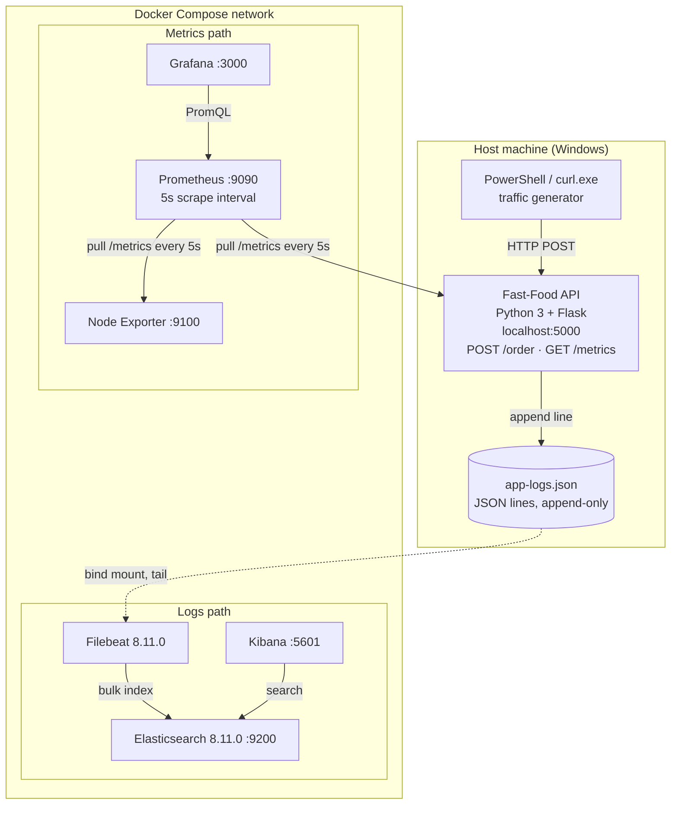

# esd-assignment1
Enterprise Software Development Observability Assignment
# Fast-Food API — Observability Stack

**Assignment 1 — Observability**
Metrics, logging, and failure investigation for a simulated fast-food ordering API, built on Prometheus, Grafana, Elasticsearch, Kibana, and Filebeat.

📄 **Full write-up:** see [`Report.md`](./Report.md) for the complete assignment report — problem statement, design rationale, metric inventory, log pipeline, architecture diagram, and the two fault-injection experiments with results.

---

## Overview

A fast-food outlet taking orders over an API has a blind spot: the API responds in milliseconds, but the customer's real wait is dominated by kitchen preparation time that happens *after* the request returns. A healthy `200 OK` and a ten-second wait look identical from the outside.

This project instruments a small Flask microservice on two independent axes so that blind spot becomes visible:

- **Metrics** (Prometheus + Grafana) — aggregate, numeric, time-series answers: how many orders are in flight, how slow is the tail (p95), is the host machine itself the bottleneck.
- **Logs** (Filebeat + Elasticsearch + Kibana) — individual, textual, searchable answers: what exactly happened to one specific order ID.

The two pipelines are kept deliberately separate because they answer different questions with different cost profiles — see [`Report.md` §D.2](./Report.md) for the reasoning.

## Architecture



## Tech stack

| Layer | Technology |
|---|---|
| Application | Python 3, Flask |
| Metrics client | `prometheus-client` |
| Structured logging | `python-json-logger` |
| Metrics storage & scraping | Prometheus |
| Dashboards | Grafana |
| Log shipping | Filebeat |
| Log storage & search | Elasticsearch |
| Log exploration UI | Kibana |
| Host metrics | Node Exporter |
| Orchestration | Docker Compose |

## Repository structure

```text
esd/
├── app.py                 # the entire application
├── requirements.txt       # flask, prometheus-client, python-json-logger
├── docker-compose.yml     # 6 services + 3 named volumes
├── prometheus.yml         # 2 scrape jobs, 5s interval
├── filebeat.yml           # 1 file input, 1 rename processor, ES output
├── app-logs.json          # log file the app writes and Filebeat reads
├── Report.md              # full assignment write-up (Parts A–E + appendix)
├── README.md              # this file
└── esd screen shots/      # evidence screenshots referenced in Report.md
```

## Prerequisites

- Docker Desktop (with Docker Compose)
- Python 3.9+
- PowerShell or any HTTP client (`curl`, Postman, etc.)

## Quick start

```bash
# 1. Bring up the observability stack (Prometheus, Grafana, Elasticsearch, Kibana, Filebeat, Node Exporter)
docker-compose up -d

# 2. Install app dependencies and start the Flask app ON THE HOST (not in Docker)
pip install -r requirements.txt
python app.py

# 3. Generate some traffic (PowerShell)
for ($i=1; $i -le 10; $i++) { curl.exe -X POST http://localhost:5000/order }
```

> The Flask app runs on the host rather than in a container. Prometheus reaches it via `host.docker.internal:5000`, configured through the `extra_hosts` entry in `docker-compose.yml`.

## Services

| Service | URL | Credentials |
|---|---|---|
| Flask app | http://localhost:5000 | — |
| Raw metrics | http://localhost:5000/metrics | — |
| Prometheus | http://localhost:9090 | — |
| Grafana | http://localhost:3000 | `admin` / `admin` |
| Elasticsearch | http://localhost:9200 | security disabled |
| Kibana | http://localhost:5601 | — |
| Node Exporter | http://localhost:9100/metrics | — |

## What's instrumented

**Metrics** (Prometheus, scraped every 5s):

| Metric | Type | Purpose |
|---|---|---|
| `orders_placed_total` | Counter | Total orders accepted; rate gives throughput |
| `orders_waiting` | Gauge | Orders currently in the kitchen |
| `cook_time_seconds` | Histogram | Preparation-time distribution; drives p95/p99 via `histogram_quantile()` |
| `cook_time_summary_seconds` | Summary | Exposes `_sum`/`_count` for a simple average, contrasted against the histogram |
| `node_*` | Mixed | Host CPU, memory, disk, network via Node Exporter |

**Logs** (Filebeat → Elasticsearch → Kibana), each line a structured JSON event:

- `Server started` — process boundary marker
- `Order received` — mints the `request_id` linking logs to metrics
- `Order complete` — closes the pair; the timestamp gap is the customer's wait

Full field-by-field detail is in [`Report.md` Part C](./Report.md).

## Dashboards

Two Grafana dashboards are used:

1. **Custom application dashboard** — order throughput, in-flight orders, average and p95 preparation time, and a histogram-vs-summary overlay.
2. **Node Exporter Full** (community dashboard ID `1860`) — host CPU/memory/disk/network, scoped to the `Bilal-Laptop` machine label.

## Experiments

Two fault-injection experiments are documented in [`Report.md` Part E](./Report.md), each with predictions made *before* the fault and measured results after:

1. **Slow order preparation** — a fixed 15s delay added to every request, showing p95 latency spike from ~7.4s to ~23.5s while every response still returns `200 OK` (invisible to error-rate monitoring alone).
2. **Cardinality explosion** — labelling a counter with a per-request unique `request_id`, showing 100 requests create 100 distinct time series, and why identifiers belong in logs (Elasticsearch), never in Prometheus labels.

## Cleaning up

```bash
docker-compose down -v     # stops containers AND deletes the three named volumes
del app-logs.json          # the host log file is not managed by Docker
```

The `-v` flag matters: without it, `prometheus_data`, `grafana_data`, and `es_data` persist and the next run starts with stale history.

## Author

Bilal
