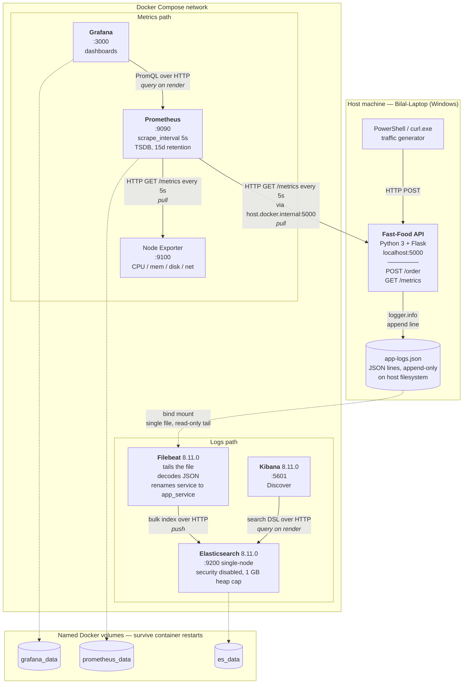

# Assignment 1 — Observability

**Fast-Food API: Metrics, Logging, and Failure Investigation**

## Part A — The Project

### A.1 The problem

A fast-food outlet that takes orders over an API has a specific operational blind spot: **the kitchen is slow in ways the ordering system cannot see.** An order is accepted in milliseconds, but the customer's actual wait is dominated by preparation time, which happens after the HTTP request is already in flight. From the outside, a healthy-looking `200 OK` and a customer who waited ten seconds are indistinguishable.

The staff running the counter need to answer three questions at any moment:

1. **How many orders are in the kitchen right now?** — so they know whether to stop taking orders.
2. **How long is an order taking?** — not on average, but at the tail, because the slowest customers are the ones who complain.
3. **What happened to order `ord_4788`?** — a specific customer, a specific complaint, a specific trail.

Questions 1 and 2 are metrics questions: aggregate, numeric, time-series. Question 3 is a logging question: individual, textual, searchable. This split is the reason the project has two separate pipelines rather than one.

### A.2 Intended users

| User | What they need | Which pipeline serves them |
|---|---|---|
| Counter / kitchen staff | Live count of orders in progress; alert when the queue backs up | Grafana (gauge panel) |
| Shift manager | Order volume over the shift; typical and worst-case preparation time | Grafana (counter + histogram panels) |
| Support staff handling a complaint | The full trail for one named order ID | Kibana (log search by `request_id`) |
| System Operator | Whether the host machine itself is the bottleneck | Grafana (Node Exporter panels) |

### A.3 The solution

A single Python 3 / Flask microservice, the **Fast-Food API**, instrumented on both axes. It exposes:

| Endpoint | Method | Purpose |
|---|---|---|
| `/order` | `POST` | Accepts an order, simulates kitchen preparation, returns the order ID |
| `/metrics` | `GET` | Prometheus exposition endpoint, served by `prometheus_client.generate_latest()` |

`POST /order` is deliberately the only endpoint that does real work. Each call:

1. Generates a request identifier of the form `ord_<4 digits>` (`random.randint(1000, 9999)`).
2. Writes an `Order received` JSON log line carrying that ID.
3. Increments three metrics (`demo_requests_total`, `orders_placed_total`, `orders_waiting`).
4. Sleeps for a randomised "cook time" to simulate the kitchen.
5. Writes an `Order complete` JSON log line carrying the same ID.
6. In a `finally` block, observes the elapsed duration into a histogram and a summary, and decrements the in-flight gauge.

The `finally` block matters: the gauge is decremented and the duration recorded even if the request raises an exception, guaranteeing the gauge does not leak upward on an error path.

### A.4 Repository layout

The workspace folder is named `esd`:

```text
esd/
├── app.py                 # the entire application (73 lines)
├── requirements.txt       # flask, prometheus-client, python-json-logger
├── docker-compose.yml     # 6 services + 3 named volumes
├── prometheus.yml         # 2 scrape jobs, 5s interval
├── filebeat.yml           # 1 file input, 1 rename processor, ES output
└── app-logs.json          # the log file the app writes and Filebeat reads

```

### A.5 How to run it

```bash
# 1. Bring up the observability stack (from inside esd/)
docker-compose up -d

# 2. Install app dependencies and start the Flask app ON THE HOST
pip install -r requirements.txt
python app.py


# 3. Generate traffic (PowerShell)
for ($i=1; $i -le 10; $i++) { curl.exe -X POST http://localhost:5000/order }

```

| Service | URL | Credentials |
| --- | --- | --- |
| Flask app | `http://localhost:5000` | — |
| Raw metrics | `http://localhost:5000/metrics` | — |
| Prometheus | `http://localhost:9090` | — |
| Grafana | `http://localhost:3000` | `admin` / `admin` |
| Elasticsearch | `http://localhost:9200` | security disabled |
| Kibana | `http://localhost:5601` | — |
| Node Exporter | `http://localhost:9100/metrics` | — |

**Clean-up:**

```bash
docker-compose down -v     # stops containers AND deletes the three named volumes
del app-logs.json          # the host log file is not managed by Docker

```

The `-v` flag is critical: without it, `prometheus_data`, `grafana_data`, and `es_data` survive, and the next run starts with stale history.


---

## Part B — Metrics

### B.1 Prometheus configuration

`prometheus.yml` defines a global scrape interval and two jobs:

```yaml
global:
  scrape_interval: 5s

scrape_configs:
  - job_name: 'fast-food-api'
    static_configs:
      - targets: ['host.docker.internal:5000']
  - job_name: 'node-exporter'
    static_configs:
      - targets: ['node-exporter:9100']
        labels:
          machine: 'Bilal-Laptop'
```

**A 5-second scrape interval.** The Prometheus default is 15s. I shortened it to 5s because the Part E experiments are short — a fault window of two or three minutes yields only ~10 samples at 15s, which is too coarse to see a step change clearly. At 5s, the same window gives ~30 samples per series.

**`host.docker.internal` rather than a container name.** The Flask app runs **on the host**, not in Docker. The `extra_hosts` entry in `docker-compose.yml` maps that hostname to the Docker bridge gateway address, enabling the container to reach the host's `localhost:5000`.


### B.2 Grafana configuration

Grafana runs as a container on port 3000 with `GF_SECURITY_ADMIN_PASSWORD=admin`, and persists dashboards and users to the `grafana_data` named volume so they survive `docker-compose down` (without `-v`). For local demonstration purposes, the admin password is intentionally committed in plaintext.

### B.3 Metric inventory

All metrics are declared at module scope in `app.py` and recorded inside `place_order()`.

| Metric | Type | Unit | Labels | Code Location | Purpose |
|---|---|---|---|---|---|
| `orders_placed_total` | Counter | orders | none | `place_order()` | **Business metric.** Monotonic total of orders ever accepted. Rate-of-change gives order throughput. |
| `orders_waiting` | Gauge | orders | none | `place_order()` | **Business metric.** Orders currently in the kitchen. Decremented in `finally` to ensure release on exception. |
| `cook_time_seconds` | Histogram | seconds | `le` (buckets) | `finally` block | **Application metric.** Distribution of order preparation time. Bucket counts allow p95/p99 estimations. |
| `cook_time_summary_seconds` | Summary | seconds | none | `finally` block | **Application metric.** Exposes `_sum` and `_count` only. Contrasts average latency calculation against histograms. |
| `node_*` | Mixed | varies | `machine="Bilal-Laptop"` | External | **Infrastructure metrics.** CPU, memory, disk, and network of the measured machine. |

### B.4 Latency: average, percentiles, and buckets

**Average preparation time** comes from the summary, by dividing the two series it exposes over a 5-minute moving window:

```promql
rate(cook_time_summary_seconds_sum[5m]) / rate(cook_time_summary_seconds_count[5m])
```

**p95 must come from the histogram**, because the Python summary client does not natively expose quantiles:

```promql
histogram_quantile(0.95, sum(rate(cook_time_seconds_bucket[5m])) by (le))
```

**Bucket Configuration:**
The histogram bucket boundaries were intentionally tuned to capture both normal traffic and the massive anomaly introduced in Part E:

```text
buckets=[0.1, 0.5, 1.0, 2.5, 5.0, 6.0, 7.0, 8.0, 9.0, 10.0, 15.0, 20.0, 30.0]
```

The boundaries at 6–10 seconds tightly bracket normal `uniform(5, 10)` cook times for highly accurate p95 interpolation, while the 15–30 second buckets gracefully capture the 20–25 second delays generated during the failure injection experiment.

### B.5 Application Dashboards (Grafana)

The custom application dashboard consists of the following PromQL queries:

1. **Total orders placed (Time series):** `increase(orders_placed_total[5m])`
2. **Orders in the kitchen (Gauge):** `orders_waiting`
3. **Average preparation time (Time series):** `rate(cook_time_summary_seconds_sum[1m]) / rate(cook_time_summary_seconds_count[1m])`
4. **p95 response time (Time series):** `histogram_quantile(0.95, sum(rate(cook_time_seconds_bucket[5m])) by (le))`
5. **Self-Explored Metric (Histogram vs. Summary Overlay):** Plotting `rate(cook_time_seconds_sum[5m]) / rate(cook_time_seconds_count[5m])` alongside the summary average on the same panel to empirically demonstrate that both metric types agree perfectly on the mathematical mean.


### B.6 Machine Metrics (Node Exporter)

Alongside the app's own metrics, I added Node Exporter to the Docker Compose setup to track the health of the machine the app runs on. Prometheus scrapes Node Exporter's `:9100` endpoint every 5 seconds, the same as it does for the app's `/metrics` endpoint, and every metric from it is labelled `machine="Bilal-Laptop"` so it's clear which machine the numbers belong to.

Rather than building the CPU/memory/disk/network panels by hand, I imported Grafana's official **Node Exporter Full** community dashboard (dashboard ID `1860`) and pointed it at my Prometheus data source. This gave me a full dashboard covering:

* **CPU usage** — per-core and overall CPU utilization.
* **Memory usage** — used vs. available RAM.
* **Disk usage** — free vs. used space, and disk I/O.
* **Network traffic** — bytes sent and received per second.

All panels are automatically scoped to the `Bilal-Laptop` machine label set in `prometheus.yml`. This is separate from the app metrics above — it's tracking the health of the underlying machine rather than anything about the Fast-Food API itself — but it's useful for spotting cases where the app looks slow because the host machine is under load, not because of a bug in the app.

*(Note: Because Node Exporter is running in a minimal container without host bind-mounts for `/proc`, `/sys`, or `/`, it is measuring the Docker VM/container environment's resource limits rather than the raw host hardware).*


## Part C — Logs

### C.1 The Pipeline

```text
Flask app (host)  →  app-logs.json  →  Filebeat (container)  →  Elasticsearch  →  Kibana
   writes JSON        file on disk       reads + parses           indexes           searches
```

No Logstash. Filebeat parses the JSON natively, which is possible precisely because the application writes structured JSON rather than free text.

### C.2 What is logged, why, and where

Logging is configured at the top of `app.py` using `python-json-logger`:

```python
formatter = jsonlogger.JsonFormatter('%(asctime)s %(levelname)s %(message)s')
```

There are three log events in the application:

| Event | Code location | Level | Fields carried | Why it exists |
|---|---|---|---|---|
| `Server started` | `if __name__ == '__main__'` block | INFO | `service`, `severity` | Marks a process boundary/restart where counters reset to zero. |
| `Order received` | Top of `place_order()` | INFO | `request_id`, `service`, `severity` | Records an order entering the system and mints the ID linking logs to metrics. |
| `Order complete` | `try` block, before return | INFO | `request_id`, `service`, `severity` | Closes the pair. The timestamp gap between received/complete is the customer wait time. |

### C.3 Filebeat Collection & Parsing

```yaml
filebeat.inputs:
  - type: log
    paths:
      - /usr/share/filebeat/app-logs.json
    json.keys_under_root: true
    json.add_error_key: true

processors:
  - rename:
      fields:
        - from: "service"
          to: "app_service"
```

1. **Harvesting:** Filebeat tails `app-logs.json` via a bind mount.
2. **JSON Decoding:** `json.keys_under_root: true` promotes all decoded JSON keys to the top level of the event (e.g., `request_id` instead of `json.request_id`).
3. **Collision Avoidance:** The `rename` processor moves `service` to `app_service`. This avoids mapping collisions with the default Elastic Common Schema (ECS), which defines `service` as an object, not a string.
4. **Output:** Events are bulk-shipped directly to `elasticsearch:9200`.

### C.4 One log line, traced into Elasticsearch

**The original line** in `app-logs.json`:

```json
{"asctime": "2026-09-21 10:05:48,509", "levelname": "INFO", "message": "Order received", "request_id": "ord_6197", "service": "food-api", "severity": "INFO"}
```

**As successfully indexed into Elasticsearch (retrieved from Kibana):**

```json
{
  "_index": "filebeat-8.11.0",
  "_source": {
    "@timestamp": "2026-09-21T05:05:57.578Z",
    "asctime": "2026-09-21 10:05:48,509",
    "message": "Order received",
    "request_id": "ord_6197",
    "app_service": "food-api",
    "levelname": "INFO",
    "severity": "INFO"
  }
}
```

*Note: Because no date processor was configured in Filebeat, `@timestamp` reflects the ingest time, while `asctime` is kept as a raw string detailing the exact local application event time.*

### C.5 Storage, Retention, and Search

| Stage | Location | Deletion policy |
|---|---|---|
| Application | `app-logs.json` on the host | None. The file is append-only and deleted manually. |
| Elasticsearch | `es_data` named volume | None. Documents are stored in a classic index (`filebeat-8.11.0`) relying on standard disk limits. |
| Prometheus | `prometheus_data` named volume | TSDB default 15-day retention. |

**Kibana Searching:**

The data view is `filebeat-*` using KQL syntax.

* **Trace a specific order:** `request_id : "ord_6197"` (Returns the exact `Order received` and `Order complete` pair for support tracing).
* **Find errors:** `levelname : "ERROR"` (Currently returns zero results as the application is strictly a happy-path simulation).


## Part D — System Design

### D.1 Architecture Diagram



### D.2 Data Flows and Failure States

**Why two pipelines instead of one:** They answer different questions with different cost profiles. Metrics are pulled samples on a fixed cadence (O(series × time)), remaining cheap as traffic grows. Logs are pushed events (O(events)), scaling linearly with traffic volume.

**Failure Scenarios:**

* **Prometheus fails:** Data is lost permanently for the outage window because it relies on a pull model with no app-side buffering.


* **Filebeat fails:** Data is not lost. The app safely appends to `app-logs.json` on the host, and Filebeat will resume reading from its last offset once restored (push model with local disk buffer).


* **Flask app fails:** In-memory Prometheus counters reset to 0, which Grafana handles gracefully using the `rate()` function.


### D.3 What I do not yet fully understand

* **Prometheus TSDB Internals:** I understand the data model, but I do not understand the underlying on-disk chunk encoding (XOR compression) well enough to reason about exact byte storage costs.


* **`histogram_quantile()` Error Bounds:** I understand it interpolates linearly within buckets, but I have not derived the mathematical error bound to state precisely how far off a given p95 estimate might be.


---

## Part E — Experiments

### E.1 Anomaly: Slow Order Preparation

**The Problem:** Latency degradation. The kitchen becomes significantly slower while every request still returns `200 OK`. This is critical because it is invisible to standard error-rate monitoring.

**Prediction:**

* `cook_time_seconds` p95 and average: Will rise sharply.


* `rate(orders_placed_total)`: Will fall (throughput collapses due to the sequential client loop).


* Log Volume & Severity: Unchanged. The timestamps will simply gap further apart.


**The Fault Injection:**
I edited `app.py` to add a massive 15-second fixed delay to *every* request.

```python
cook_time = random.uniform(5.0, 10.0) + 15  # FAULT
time.sleep(cook_time)

```

**Measured Effect & User Impact:**

* **Baseline Latency:** ~7.4 seconds average.


* **Fault Latency:** Spiked to ~23.5 seconds average (comfortably within the predicted 20–25s range).


* **Impact:** Every customer waited 3x longer without any errors being thrown. A standard HTTP alert would not have triggered.


* **Recovery:** Reverting the `+ 15` code immediately returned latency to the baseline 7.4 seconds.


### E.2 Cardinality Explosion

Cardinality explosion occurs when a label value is unique per event (like a Request ID), creating an unbounded number of new time series that consume excessive TSDB memory.

**The Experiment:**
I added a dummy counter `DEMO_REQUESTS` labelled with the unique `request_id`.

1. Baseline `count(demo_requests_total)` read `0`.


2. I ran a 100-request loop via PowerShell.


3. After the loop, `count(demo_requests_total)` exploded to exactly `100`.


4. I removed the `['request_id']` label in the code and restarted the app. The count immediately collapsed to `1`.


**Cost at Scale & Best Practices:**
While removing the label stops new series generation, the existing 100 series remain in memory and on disk until the 15-day retention period expires. At an enterprise scale of 1,000,000 orders a day, a single bad label like this would exhaust a Prometheus server's memory almost immediately.

**Conclusion:** Identifiers belong exclusively in structured logs (Elasticsearch), where inverted indexing makes high-cardinality lookups incredibly cheap and efficient. They should never be used as metric labels in Prometheus.


---

## Appendix A — Configuration Listings

### `app.py`

```python
from flask import Flask, jsonify
from prometheus_client import Counter, Gauge, Histogram, Summary, generate_latest, CONTENT_TYPE_LATEST
import logging
from pythonjsonlogger import jsonlogger
import time
import random

app = Flask(__name__)

logger = logging.getLogger("fast-food-api")
logger.setLevel(logging.INFO)
logHandler = logging.FileHandler("app-logs.json")
formatter = jsonlogger.JsonFormatter('%(asctime)s %(levelname)s %(message)s')
logHandler.setFormatter(formatter)
logger.addHandler(logHandler)

ORDERS_PLACED  = Counter('orders_placed_total', 'Total number of orders placed')
ORDERS_WAITING = Gauge('orders_waiting', 'Number of orders currently being prepared')
COOK_TIME_HIST = Histogram('cook_time_seconds', 'Time taken to prepare an order',
                           buckets=[0.1, 0.5, 1.0, 2.5, 5.0, 6.0, 7.0, 8.0, 9.0, 10.0, 15.0, 20.0, 30.0])
COOK_TIME_SUM  = Summary('cook_time_summary_seconds', 'Summary of cook times')
DEMO_REQUESTS  = Counter('demo_requests_total', 'Test cardinality', ['request_id'])

@app.route('/order', methods=['POST'])
def place_order():
    request_id = f"ord_{random.randint(1000, 9999)}"
    logger.info("Order received", extra={"request_id": request_id,
                                         "service": "food-api", "severity": "INFO"})
    DEMO_REQUESTS.labels(request_id=request_id).inc()
    ORDERS_PLACED.inc()
    ORDERS_WAITING.inc()
    start_time = time.time()

    try:
        cook_time = random.uniform(5.0, 10.0)
        time.sleep(cook_time)
        logger.info("Order complete", extra={"request_id": request_id,
                                             "service": "food-api", "severity": "INFO"})
        return jsonify({"status": "Order ready!", "order_id": request_id}), 200
    finally:
        duration = time.time() - start_time
        COOK_TIME_HIST.observe(duration)
        COOK_TIME_SUM.observe(duration)
        ORDERS_WAITING.dec()

@app.route('/metrics')
def metrics():
    return generate_latest(), 200, {'Content-Type': CONTENT_TYPE_LATEST}

if __name__ == '__main__':
    logger.info("Server started", extra={"service": "food-api", "severity": "INFO"})
    app.run(port=5000)

```
```
